```mermaid
flowchart TB
    subgraph "1. Parse"
        SQL["SQL Text"] --> AST["SELECT Statement AST"]
    end

    subgraph "2. Bind"
        AST --> LP["LogicalPlan::Sort
        └─ Limit
           └─ Aggregate
              └─ Join
                 ├─ TableScan(sales)
                 └─ TableScan(customers)"]
    end

    subgraph "3. Optimize"
        LP --> OLP["Optimized LogicalPlan
        (predicate pushdown,
        projection pushdown)"]
    end

    subgraph "4. Physical Plan"
        OLP --> PP["Sort
        └─ Limit
           └─ HashAggregate
              └─ HashJoin
                 ├─ Scan(sales)
                 └─ Scan(customers)"]
    end

    subgraph "5. Execute"
        PP --> RB["Vec&lt;RecordBatch&gt;
        (Arrow columnar format)"]
    end
```

# Blaze Query Engine Architecture

This document provides a comprehensive overview of the Blaze query engine architecture, including system design, component interactions, and data flow.

## Table of Contents

- [System Overview](#system-overview)
- [Query Execution Pipeline](#query-execution-pipeline)
- [Module Structure](#module-structure)
- [Core Components](#core-components)
  - [Connection API](#connection-api)
  - [SQL Parser](#sql-parser)
  - [Binder](#binder)
  - [Logical Planner](#logical-planner)
  - [Optimizer](#optimizer)
  - [Physical Planner](#physical-planner)
  - [Executor](#executor)
- [Storage Layer](#storage-layer)
- [Catalog System](#catalog-system)
- [Type System](#type-system)
- [Error Handling](#error-handling)
- [Advanced Features](#advanced-features)
- [Extension Points](#extension-points)

---

## System Overview

Blaze is a high-performance, memory-safe embedded OLAP query engine written in Rust. It provides SQL:2016 compliance with native Apache Arrow integration for vectorized execution.


### Design Principles

1. **Vectorized Execution**: Process data in batches (default 8,192 rows) using Arrow's columnar format
2. **Two-Phase Planning**: Separate logical (what) from physical (how) planning
3. **Pluggable Storage**: Trait-based abstraction for multiple data formats
4. **Memory Safety**: Rust's ownership system ensures safe concurrent access
5. **Zero-Copy**: Arrow format enables efficient data sharing across components

---

## Query Execution Pipeline

Every SQL query flows through a well-defined pipeline from text to results:


### Pipeline Stages

| Stage | Input | Output | Location |
|-------|-------|--------|----------|
| **Parse** | SQL string | AST (Statement) | `sql/parser.rs` |
| **Bind** | AST + Catalog | LogicalPlan | `planner/binder.rs` |
| **Optimize** | LogicalPlan | Optimized LogicalPlan | `planner/optimizer.rs` |
| **Physical Plan** | LogicalPlan | PhysicalPlan | `planner/physical_planner.rs` |
| **Execute** | PhysicalPlan | Vec\<RecordBatch\> | `executor/mod.rs` |

### Example Query Flow

```sql
SELECT c.name, SUM(s.amount)
FROM sales s
JOIN customers c ON s.customer_id = c.id
GROUP BY c.name
ORDER BY SUM(s.amount) DESC
LIMIT 10
```



---

## Module Structure

```
src/
├── lib.rs                  # Main entry: Connection API
├── main.rs                 # CLI binary
├── error.rs                # Error types (BlazeError)
│
├── sql/                    # SQL Parsing
│   └── parser.rs           # sqlparser-rs wrapper
│
├── planner/                # Query Planning
│   ├── mod.rs              # Public exports
│   ├── binder.rs           # AST → LogicalPlan
│   ├── logical_plan.rs     # Logical operators
│   ├── logical_expr.rs     # Logical expressions
│   ├── optimizer.rs        # Rule-based optimizer
│   ├── physical_planner.rs # Logical → Physical
│   ├── physical_plan.rs    # Physical operators
│   └── physical_expr.rs    # Evaluatable expressions
│
├── executor/               # Query Execution
│   ├── mod.rs              # ExecutionContext
│   └── operators.rs        # Physical operator implementations
│
├── catalog/                # Metadata Management
│   ├── mod.rs              # CatalogList, Catalog, Schema
│   └── table.rs            # TableProvider trait
│
├── storage/                # Data Storage
│   ├── mod.rs              # Storage utilities
│   ├── memory.rs           # In-memory tables
│   ├── csv.rs              # CSV format
│   ├── parquet.rs          # Parquet format
│   └── delta.rs            # Delta Lake format
│
├── types/                  # Type System
│   ├── mod.rs              # Public exports
│   ├── datatype.rs         # DataType enum
│   ├── schema.rs           # Schema, Field
│   └── value.rs            # ScalarValue
│
└── optimizer/              # Advanced Optimization
    ├── cost_model.rs       # Cost estimation
    ├── statistics.rs       # Table statistics
    ├── cardinality.rs      # Cardinality estimation
    └── join_ordering.rs    # Join order optimization
```

---

## Core Components

### Connection API

The `Connection` is the primary user-facing API, managing database state and query execution.


**Key Methods**:

| Method | Purpose |
|--------|---------|
| `in_memory()` | Create in-memory database |
| `query(sql)` | Execute SELECT, return results |
| `execute(sql)` | Execute DDL/DML, return row count |
| `prepare(sql)` | Compile query for reuse |
| `register_csv(name, path)` | Register CSV as table |
| `register_parquet(name, path)` | Register Parquet as table |

---

### SQL Parser

Wraps `sqlparser-rs` to convert SQL text into AST.

**Location**: `src/sql/parser.rs`

```rust
pub struct Parser;

impl Parser {
    pub fn parse(&self, sql: &str) -> Result<Statement>
}
```

**Supported Statements**:
- `SELECT` (with JOINs, CTEs, subqueries, window functions)
- `INSERT`, `UPDATE`, `DELETE`
- `CREATE TABLE`, `DROP TABLE`
- `EXPLAIN`, `EXPLAIN ANALYZE`
- `COPY` (import/export)

---

### Binder

Transforms parsed AST into a `LogicalPlan` by resolving names and validating types.

**Location**: `src/planner/binder.rs`


**Responsibilities**:
1. Resolve table references via Catalog
2. Bind column references to schemas
3. Validate expression types
4. Handle CTEs and subqueries
5. Enforce depth limits (max 128 nesting levels)

---

### Logical Planner

Represents **what** to compute without specifying **how**.

**Location**: `src/planner/logical_plan.rs`, `src/planner/logical_expr.rs`


**Logical Plan Nodes**:

| Node | SQL Equivalent | Description |
|------|---------------|-------------|
| `TableScan` | `FROM table` | Source of data |
| `Projection` | `SELECT exprs` | Output columns |
| `Filter` | `WHERE cond` | Row filtering |
| `Aggregate` | `GROUP BY` | Grouping + aggregates |
| `Sort` | `ORDER BY` | Result ordering |
| `Limit` | `LIMIT n OFFSET m` | Row limiting |
| `Join` | `JOIN` | Table joins |
| `Window` | `OVER (...)` | Window functions |

---

### Optimizer

Transforms logical plans for better performance using rule-based transformations.

**Location**: `src/planner/optimizer.rs`, `src/optimizer/`


**Optimization Rules**:

| Rule | Effect |
|------|--------|
| **SimplifyExpressions** | Simplify boolean logic |
| **ConstantFolding** | Evaluate constants at plan time |
| **PredicatePushdown** | Move filters closer to sources |
| **ProjectionPushdown** | Request only needed columns |
| **EliminateLimit** | Remove redundant limits |

**Cost-Based Components** (`src/optimizer/`):
- `CostModel`: CPU/IO cost estimation
- `Statistics`: Table/column statistics
- `CardinalityEstimator`: Row count prediction
- `JoinOrderOptimizer`: Multi-way join reordering

---

### Physical Planner

Converts logical plans to executable physical plans.

**Location**: `src/planner/physical_planner.rs`, `src/planner/physical_plan.rs`, `src/planner/physical_expr.rs`


**Key Differences from Logical Plan**:
- Columns referenced by **index** (not name)
- Expressions are **executable** (implement `evaluate()`)
- Specific algorithms chosen (e.g., `HashJoin` not just `Join`)
- Arrow schemas for execution

---

### Executor

Runs physical plans to produce results.

**Location**: `src/executor/mod.rs`, `src/executor/operators.rs`


**Physical Operators**:

| Operator | Algorithm | Complexity |
|----------|-----------|------------|
| `HashJoin` | Hash-based | O(n + m) |
| `HashAggregate` | Hash table | O(n) |
| `Sort` | In-memory sort | O(n log n) |
| `Filter` | Predicate evaluation | O(n) |
| `Projection` | Expression evaluation | O(n) |
| `Window` | Partitioned computation | O(n log n) |

---

## Storage Layer

Trait-based abstraction for multiple storage formats.


**Storage Providers**:

| Provider | Format | Filter Pushdown | Statistics |
|----------|--------|-----------------|------------|
| `MemoryTable` | In-memory | No | Yes |
| `CsvTable` | CSV files | Yes | No |
| `ParquetTable` | Parquet files | Yes | Yes |
| `DeltaTable` | Delta Lake | Yes | Yes |

**Auto-Detection**: `read_file(path)` detects format by extension:
- `.csv`, `.tsv` → `CsvTable`
- `.parquet`, `.pq` → `ParquetTable`
- Directory with `_delta_log/` → `DeltaTable`

---

## Catalog System

Hierarchical metadata management.


**Resolution Order**:
1. `table` → `default.main.table`
2. `schema.table` → `default.schema.table`
3. `catalog.schema.table` → fully qualified

**Components**:

| Component | Purpose |
|-----------|---------|
| `CatalogList` | Root container for catalogs |
| `Catalog` | Named container for schemas |
| `SchemaProvider` | Container for tables |
| `TableProvider` | Data source interface |

---

## Type System

SQL types mapped to Arrow types.

**Location**: `src/types/`


**Type Conversions**:
- `DataType::to_arrow()` → Arrow `DataType`
- `DataType::from_sql_type()` → Parse SQL type strings
- `Schema::to_arrow()` → Arrow `Schema`

---

## Error Handling

Comprehensive error types with context.

**Location**: `src/error.rs`

```rust
pub enum BlazeError {
    Parse { message: String, location: Option<Location> },
    Analysis(String),
    Plan(String),
    Optimization(String),
    Execution(String),
    Type { expected: String, actual: String },
    Schema { message: String },
    Catalog { name: String },
    Arrow(arrow::error::ArrowError),
    Parquet(parquet::errors::ParquetError),
    ResourceExhausted { message: String },
    NotImplemented(String),
    InvalidArgument(String),
    Internal(String),
}
```

**Helper Methods**:
```rust
BlazeError::parse("unexpected token", Some(location))
BlazeError::analysis("column 'x' not found")
BlazeError::type_error("Int64", "Utf8")
BlazeError::not_implemented("LATERAL JOIN")
```

---

## Advanced Features

### Production Features

#### Lakehouse Support (`src/lakehouse/`)
- Delta Lake integration with time travel
- Iceberg format support
- Snapshot management

#### Python Bindings (`src/python.rs`)
- PyO3-based bindings
- Zero-copy PyArrow integration
- Pandas/Polars interoperability

#### Adaptive Query Execution (`src/adaptive/`)
- Runtime statistics collection
- Plan adjustments based on observed data
- Skew handling

### Experimental Features

> **Note**: These features are under active development and APIs may change.

#### Parallel Execution (`src/parallel/`) ⚠️ Experimental
- Exchange operators for data shuffling
- Worker pool for distributed computation
- Partition-based parallelism

#### GPU Acceleration (`src/gpu/`) ⚠️ Experimental
- CUDA kernel execution
- GPU memory management
- Offloading compute-intensive operations

### Planned Features

#### WebAssembly Support (`src/wasm/`) 📋 Planned
- Browser-based query execution
- Edge computing deployment
- JavaScript/TypeScript integration

---

## Extension Points

Blaze provides several extension mechanisms:

### Custom Storage Provider

```rust
impl TableProvider for MyStorage {
    fn schema(&self) -> &Schema { /* ... */ }

    fn scan(
        &self,
        projection: Option<&[usize]>,
        filters: &[Arc<dyn PhysicalExpr>],
        limit: Option<usize>,
    ) -> Result<Vec<RecordBatch>> {
        // Custom implementation
    }
}

// Register
conn.register_table("my_table", Arc::new(MyStorage::new()))?;
```

### Custom Optimizer Rule

```rust
impl OptimizerRule for MyRule {
    fn name(&self) -> &str { "my_rule" }

    fn apply(&self, plan: &LogicalPlan) -> Result<LogicalPlan> {
        // Transform plan
    }
}
```

### Custom Physical Expression

```rust
impl PhysicalExpr for MyExpr {
    fn evaluate(&self, batch: &RecordBatch) -> Result<ArrayRef> {
        // Evaluate expression
    }

    fn data_type(&self) -> ArrowDataType { /* ... */ }
    fn name(&self) -> &str { "my_expr" }
}
```

---

## Configuration

```rust
let conn = Connection::with_config(
    ConnectionConfig::new()
        .with_batch_size(8192)      // Vectorization batch size
        .with_memory_limit(1 << 30) // 1GB memory limit
        .with_num_threads(8)        // Parallel workers
)?;
```

| Parameter | Default | Range | Description |
|-----------|---------|-------|-------------|
| `batch_size` | 8,192 | 1 - 16M | Rows per batch |
| `memory_limit` | None | Any | Max memory usage |
| `num_threads` | None | 1+ | Parallel workers |

---

## Further Reading

- [ADR-0001: Rust as Implementation Language](adr/0001-rust-as-implementation-language.md)
- [ADR-0002: Apache Arrow as Native Data Format](adr/0002-apache-arrow-as-native-data-format.md)
- [ADR-0003: Layered Query Processing Architecture](adr/0003-layered-query-processing-architecture.md)
- [ADR-0004: Two-Phase Planning](adr/0004-two-phase-planning.md)
- [ADR-0005: Trait-Based Pluggable Storage](adr/0005-trait-based-pluggable-storage.md)
- [ADR-0006: Batch-Oriented Vectorized Execution](adr/0006-batch-oriented-vectorized-execution.md)
- [ADR-0007: Hash-Based Join and Aggregation](adr/0007-hash-based-join-aggregation.md)
- [ADR-0008: Rule-Based Optimizer](adr/0008-rule-based-optimizer.md)
