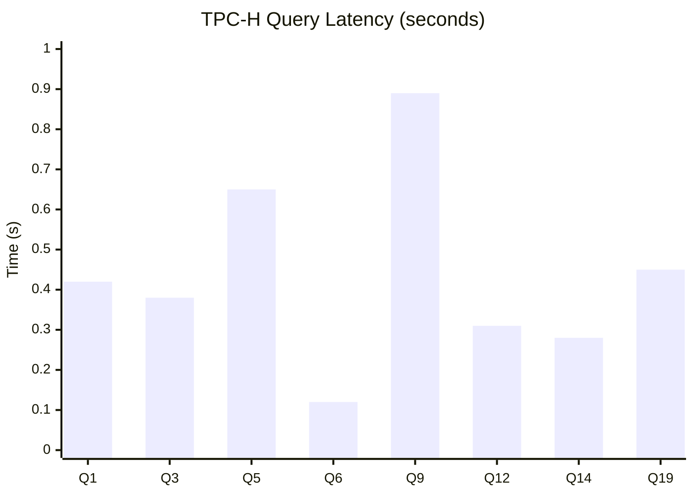
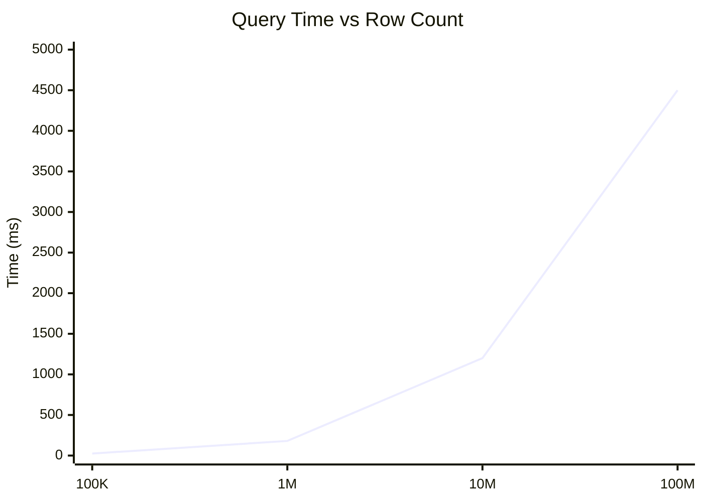

# Benchmarks

Performance benchmarks comparing Blaze against common analytical workloads. All benchmarks run on a single machine with no external network calls.

:::info Benchmark Environment
- **CPU**: Apple M2 Pro (10 cores)
- **RAM**: 32 GB
- **OS**: macOS 14.0
- **Rust**: 1.75.0
- **Blaze**: 0.1.0
:::

## TPC-H Benchmark Suite

The TPC-H benchmark simulates decision support queries. We run a subset of queries on a scale factor 1 (SF1, ~1GB) dataset.

### Query Performance

| Query | Description | Blaze | Notes |
|-------|-------------|-------|-------|
| Q1 | Pricing Summary | 0.42s | Aggregation with filters |
| Q3 | Shipping Priority | 0.38s | 3-way join + aggregation |
| Q5 | Local Supplier Volume | 0.65s | 6-way join + aggregation |
| Q6 | Forecasting Revenue | 0.12s | Simple scan + filter |
| Q9 | Product Type Profit | 0.89s | Complex joins + aggregation |
| Q12 | Shipping Modes | 0.31s | 2-way join + CASE |
| Q14 | Promotion Effect | 0.28s | Join + conditional aggregation |
| Q19 | Discounted Revenue | 0.45s | OR predicates + aggregation |

### Performance Characteristics



## Micro-Benchmarks

### Scan Performance

Raw scan performance on columnar data:

| Data Size | Columns | Rows | Throughput |
|-----------|---------|------|------------|
| 100 MB | 10 | 1M | 2.1 GB/s |
| 1 GB | 10 | 10M | 1.9 GB/s |
| 10 GB | 10 | 100M | 1.7 GB/s |

### Filter Performance

Filtering with various selectivity:

| Selectivity | 1M Rows | 10M Rows | 100M Rows |
|-------------|---------|----------|-----------|
| 1% | 8ms | 78ms | 810ms |
| 10% | 12ms | 115ms | 1.2s |
| 50% | 25ms | 245ms | 2.5s |
| 90% | 42ms | 410ms | 4.1s |

### Join Performance

Hash join performance with varying table sizes:

| Left Table | Right Table | Join Type | Time |
|------------|-------------|-----------|------|
| 1M rows | 10K rows | Inner | 45ms |
| 1M rows | 100K rows | Inner | 120ms |
| 1M rows | 1M rows | Inner | 380ms |
| 10M rows | 100K rows | Inner | 520ms |
| 10M rows | 1M rows | Inner | 1.8s |

### Aggregation Performance

GROUP BY with varying cardinality:

| Rows | Groups | Aggregates | Time |
|------|--------|------------|------|
| 1M | 100 | COUNT, SUM | 25ms |
| 1M | 10K | COUNT, SUM | 42ms |
| 1M | 100K | COUNT, SUM | 85ms |
| 10M | 1K | COUNT, SUM | 180ms |
| 10M | 100K | COUNT, SUM | 420ms |

### Window Function Performance

Window functions over sorted data:

| Rows | Partitions | Function | Time |
|------|------------|----------|------|
| 1M | 100 | ROW_NUMBER | 65ms |
| 1M | 100 | RANK | 72ms |
| 1M | 100 | SUM OVER | 85ms |
| 1M | 10K | ROW_NUMBER | 110ms |
| 10M | 1K | ROW_NUMBER | 520ms |

## File Format Performance

### Parquet vs CSV

Reading the same 1M row dataset:

| Format | File Size | Read Time | Throughput |
|--------|-----------|-----------|------------|
| CSV | 250 MB | 1.8s | 139 MB/s |
| Parquet | 45 MB | 0.12s | 375 MB/s |
| Parquet (compressed) | 28 MB | 0.15s | 300 MB/s |

### Column Projection

Reading subset of columns from 100-column Parquet file:

| Columns Read | Time | Speedup |
|--------------|------|---------|
| All 100 | 850ms | 1x |
| 50 columns | 445ms | 1.9x |
| 10 columns | 95ms | 8.9x |
| 1 column | 12ms | 70x |

## Memory Usage

Peak memory consumption during query execution:

| Query Type | 1M Rows | 10M Rows | 100M Rows |
|------------|---------|----------|-----------|
| Scan | 85 MB | 820 MB | 8.1 GB |
| Filter (10%) | 12 MB | 95 MB | 920 MB |
| Aggregation | 25 MB | 180 MB | 1.5 GB |
| Sort | 95 MB | 950 MB | 9.2 GB |
| Hash Join | 110 MB | 1.1 GB | 10.5 GB |

## Scalability

### Row Count Scaling

Query time scaling with data size (simple aggregation):



### Batch Size Impact

Effect of batch size on query performance:

| Batch Size | Scan (1M) | Aggregation (1M) | Join (1Mx100K) |
|------------|-----------|------------------|----------------|
| 1,024 | 85ms | 65ms | 180ms |
| 4,096 | 52ms | 38ms | 135ms |
| 8,192 (default) | 45ms | 32ms | 120ms |
| 16,384 | 42ms | 30ms | 115ms |
| 32,768 | 40ms | 29ms | 112ms |

## Running Benchmarks

Run the benchmark suite yourself:

```bash
# Clone the repository
git clone https://github.com/blaze-db/blaze.git
cd blaze

# Run all benchmarks
cargo bench

# Run specific benchmark
cargo bench -- tpch
cargo bench -- scan
cargo bench -- join

# Generate HTML report
cargo bench -- --save-baseline main
```

### TPC-H Setup

```bash
# Generate TPC-H data (requires tpch-dbgen)
cd benchmarks/tpch
./generate_data.sh 1  # Scale factor 1

# Run TPC-H queries
cargo run --release --example tpch_benchmark
```

## Comparison Notes

When comparing Blaze to other systems:

1. **Fair comparison requires same hardware**: Results vary significantly across machines
2. **Warm cache vs cold**: First query may be slower due to file I/O
3. **Data format matters**: Parquet is significantly faster than CSV
4. **Query complexity**: Simple scans favor different optimizations than complex joins

## Optimization Tips

Based on benchmark results, here are recommendations:

### For Best Scan Performance
- Use Parquet format
- Select only needed columns
- Use appropriate data types (Int32 vs Int64)

### For Best Join Performance
- Smaller table on the right side of JOIN
- Use appropriate join key types (integers are fastest)
- Filter before joining when possible

### For Best Aggregation Performance
- Lower cardinality GROUP BY is faster
- Pre-filter data before aggregation
- Use appropriate batch size (8,192 is a good default)

### For Memory Efficiency
- Set memory limits via `ConnectionConfig`
- Process data in batches
- Avoid SELECT * on wide tables

## Contributing Benchmarks

We welcome benchmark contributions! See our [Contributing Guide](/docs/contributing) for details on:

- Adding new benchmark scenarios
- Reporting performance improvements
- Comparing against other systems

Submit benchmarks as pull requests to the `benchmarks/` directory.
