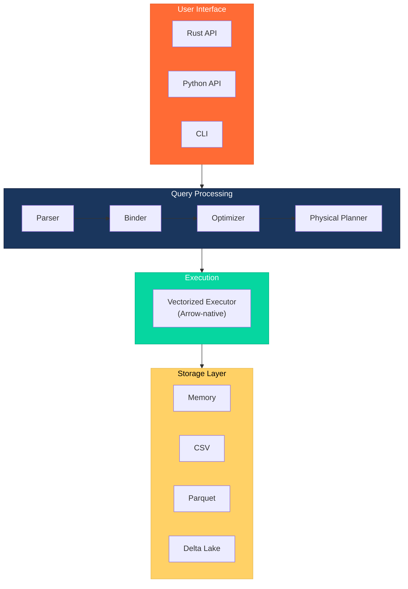
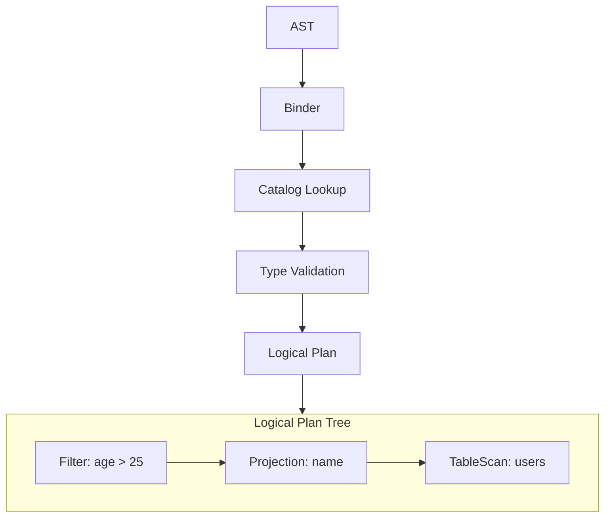
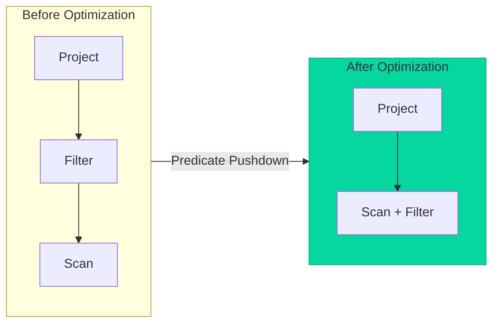
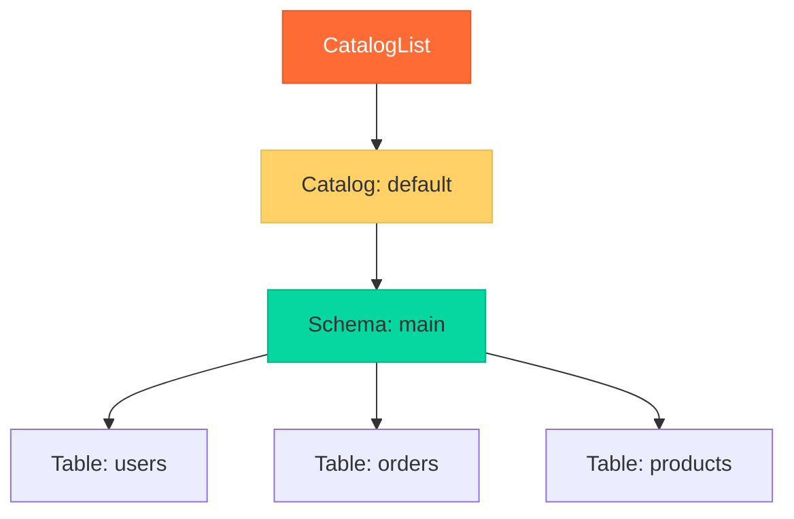
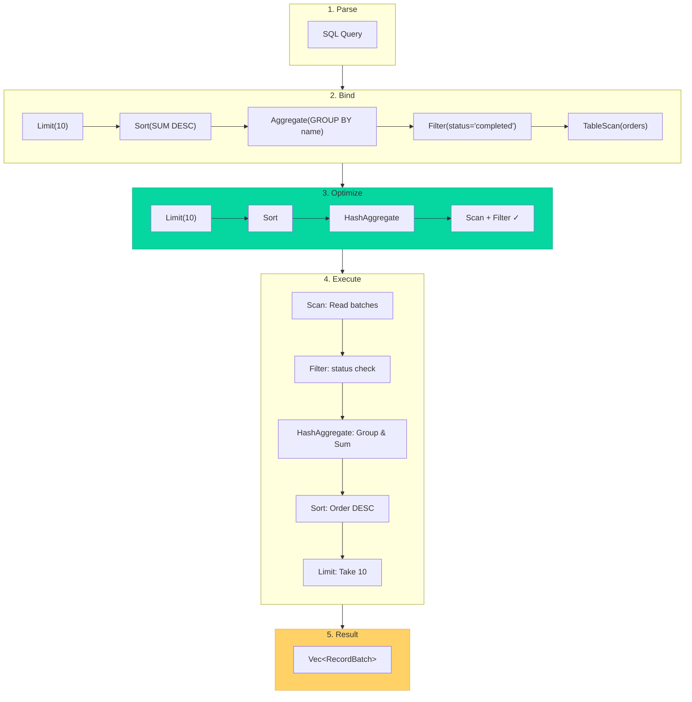
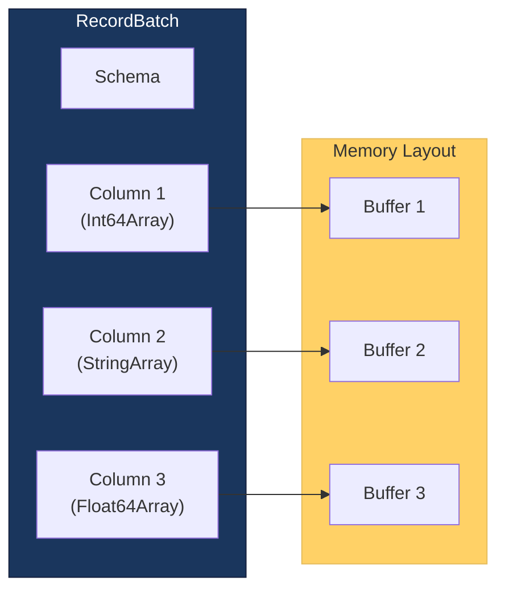

# Architecture

Understanding Blaze's architecture helps you write efficient queries and extend the engine. This guide covers the query processing pipeline and core components.

## System Overview

Blaze follows a layered architecture with clear separation of concerns:



## Query Processing Pipeline

Every SQL query flows through a well-defined pipeline:


### 1. Parsing

The **Parser** converts SQL text into an Abstract Syntax Tree (AST).

```
SQL: "SELECT name FROM users WHERE age > 25"
         ↓
AST: SelectStatement {
       columns: [Column("name")],
       from: [Table("users")],
       where: BinaryExpr(Column("age"), Gt, Literal(25))
     }
```

**Location**: `src/sql/parser.rs`

### 2. Binding

The **Binder** transforms the AST into a logical plan by:

- Resolving table and column references via the Catalog
- Validating that columns exist and types are compatible
- Handling CTEs and subqueries
- Enforcing query depth limits (max 128 levels)



**Location**: `src/planner/binder.rs`

### 3. Optimization

The **Optimizer** applies transformation rules to improve query performance:

| Rule | Effect |
|------|--------|
| **Predicate Pushdown** | Move filters closer to data sources |
| **Projection Pushdown** | Request only needed columns |
| **Constant Folding** | Evaluate constant expressions at plan time |
| **Simplify Expressions** | Simplify boolean logic |



**Location**: `src/planner/optimizer.rs`

### 4. Physical Planning

The **Physical Planner** converts the logical plan into an executable physical plan:

- Columns are referenced by index (not name)
- Specific algorithms are chosen (e.g., HashJoin vs. MergeJoin)
- Expressions become executable `PhysicalExpr` implementations

**Location**: `src/planner/physical_planner.rs`

### 5. Execution

The **Executor** runs the physical plan and produces Arrow RecordBatches:

- Vectorized processing in batches (default 8,192 rows)
- SIMD-optimized operations where possible
- Memory tracking and limit enforcement

**Location**: `src/executor/mod.rs`

## Core Components

### Connection

The `Connection` is the primary entry point:

```rust
pub struct Connection {
    catalog_list: Arc<CatalogList>,      // Metadata
    execution_context: ExecutionContext,  // Runtime config
    optimizer: Optimizer,                  // Query optimizer
}
```

Key responsibilities:
- Parse and execute SQL
- Register tables and files
- Manage prepared statements

### Catalog System

Hierarchical metadata management:



Resolution order:
1. `table` → `default.main.table`
2. `schema.table` → `default.schema.table`
3. `catalog.schema.table` → fully qualified

### Logical Plan

Represents **what** to compute without specifying **how**:

```rust
pub enum LogicalPlan {
    TableScan { table_name: String, ... },
    Projection { exprs: Vec<LogicalExpr>, input: Box<LogicalPlan> },
    Filter { predicate: LogicalExpr, input: Box<LogicalPlan> },
    Aggregate { group_by: Vec<LogicalExpr>, aggr_exprs: Vec<LogicalExpr>, ... },
    Sort { exprs: Vec<SortExpr>, input: Box<LogicalPlan> },
    Limit { skip: usize, fetch: Option<usize>, input: Box<LogicalPlan> },
    Join { left: Box<LogicalPlan>, right: Box<LogicalPlan>, ... },
    Window { window_exprs: Vec<LogicalExpr>, input: Box<LogicalPlan> },
    // ... more variants
}
```

### Physical Plan

Executable plan with concrete algorithms:

```rust
pub enum PhysicalPlan {
    Scan { table: Arc<dyn TableProvider>, ... },
    Filter { predicate: Arc<dyn PhysicalExpr>, input: Box<PhysicalPlan> },
    Projection { exprs: Vec<Arc<dyn PhysicalExpr>>, input: Box<PhysicalPlan> },
    HashAggregate { ... },
    HashJoin { ... },
    Sort { ... },
    // ... more variants
}
```

### Physical Expressions

The `PhysicalExpr` trait defines evaluatable expressions:

```rust
pub trait PhysicalExpr: Send + Sync {
    fn evaluate(&self, batch: &RecordBatch) -> Result<ArrayRef>;
    fn data_type(&self) -> DataType;
    fn name(&self) -> &str;
}
```

Implementations include:
- `ColumnExpr`: Reference columns by index
- `LiteralExpr`: Constant values
- `BinaryExpr`: Operations like `+`, `-`, `*`, `/`, `=`, `AND`, `OR`
- `CastExpr`: Type conversions
- `CaseExpr`: CASE WHEN expressions
- `ScalarFunctionExpr`: Built-in functions

## Data Flow Example

Here's how data flows through the system for a query:

```sql
SELECT name, SUM(amount)
FROM orders
WHERE status = 'completed'
GROUP BY name
ORDER BY SUM(amount) DESC
LIMIT 10
```



## Memory Model

Blaze uses Arrow's columnar memory model:



Benefits:
- Zero-copy data sharing
- Cache-efficient columnar access
- SIMD-friendly memory layout

## Thread Safety

- `Connection` is **not** thread-safe (each thread should have its own)
- RecordBatches are immutable and can be shared across threads
- Storage providers use interior mutability with proper synchronization

## Next Steps

- [Connection API](/docs/concepts/connection-api) - Working with connections
- [Query Execution](/docs/concepts/query-execution) - Execution details
- [Query Optimization](/docs/advanced/query-optimization) - Understanding the optimizer
